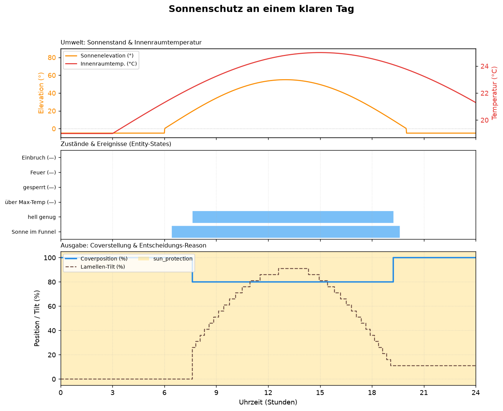
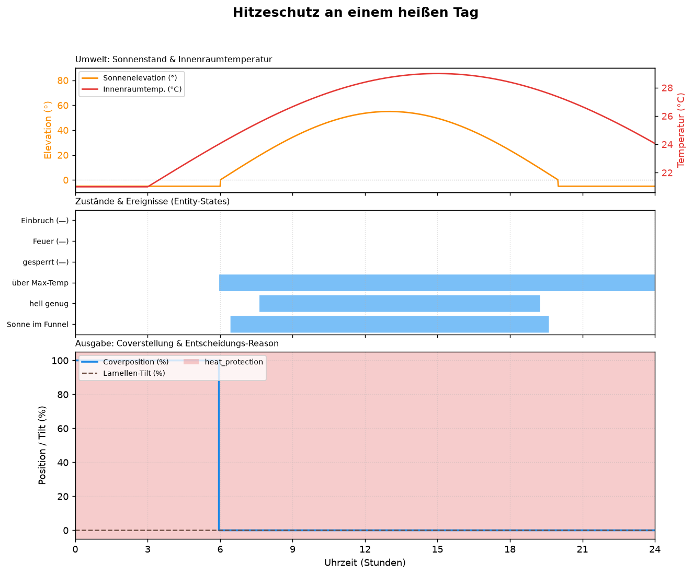
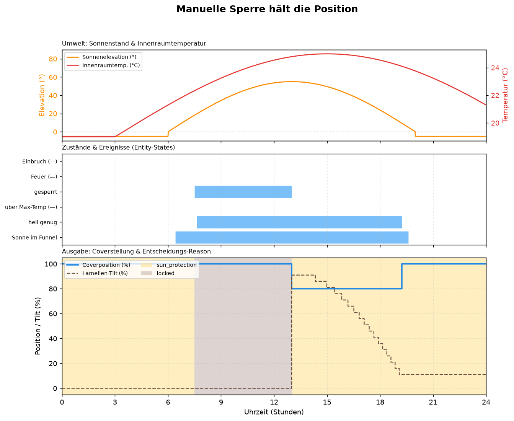
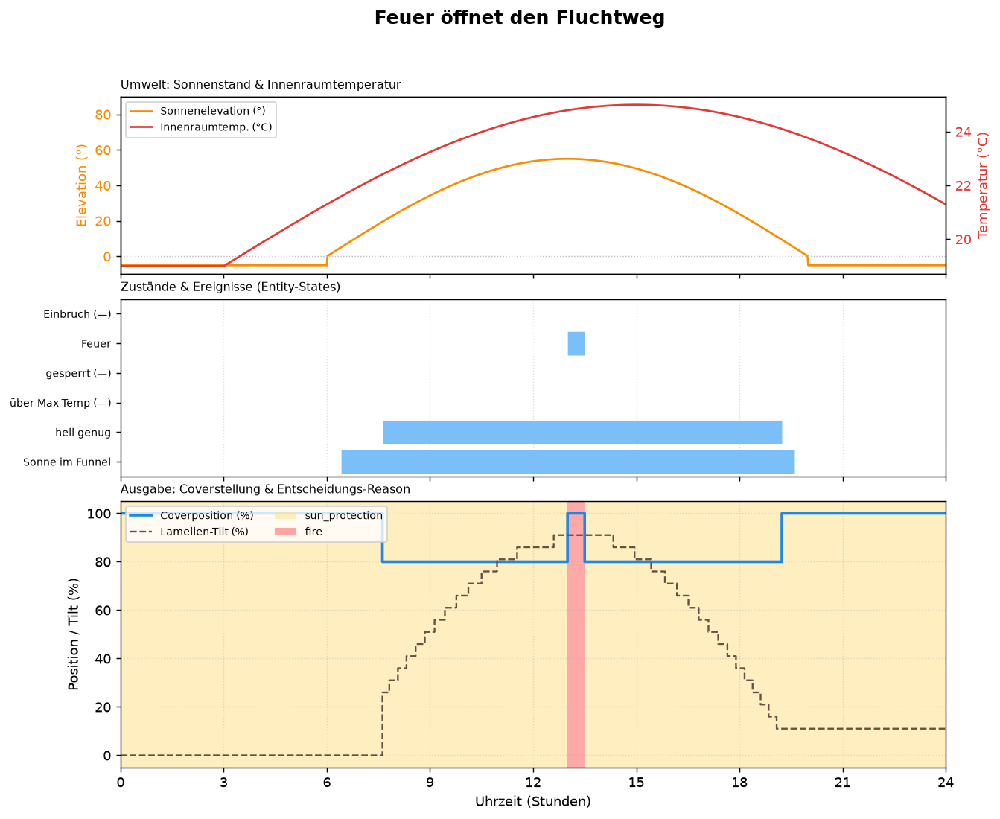
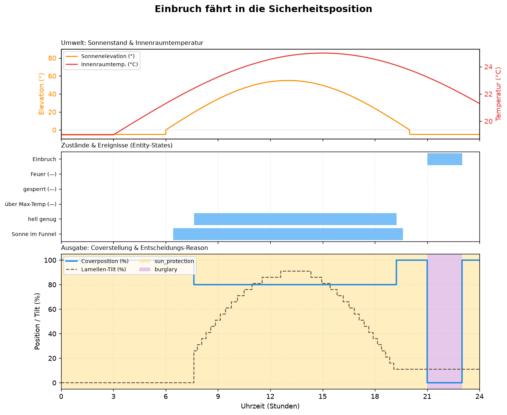

# Verhalten in Beispielen (visuelle Testfälle)

Diese Seite dokumentiert anhand „realer" Tagesverläufe, wie sich die
Controller/Treiber der Shutter Engine verhalten. Jede Grafik stammt aus einer
**zeitreihenbasierten Simulation**: rohe Eingänge (Sonnenstand,
Innenraumtemperatur, Ereignis-Entities) werden Minute für Minute durch dieselbe
Logik geschickt wie im echten Koordinator, und der Resolver-Ausgang
(Coverstellung, Lamellen-Tilt, Entscheidungs-Reason) wird mitgeschrieben.

Die Grafiken werden direkt aus dem Code erzeugt und bleiben damit immer mit dem
tatsächlichen Engine-Verhalten konsistent:

```bash
pip install -r requirements_test.txt
pytest tests/test_visual_scenarios.py
```

Die Szenarien liegen in [`tests/visual/`](../tests/visual/), die zugehörigen
Verhaltens-Assertions in
[`tests/test_visual_scenarios.py`](../tests/test_visual_scenarios.py).

## So liest man die Diagramme

Jedes Diagramm hat drei übereinanderliegende Panels mit gemeinsamer Zeitachse
(0–24 Uhr):

1. **Umwelt** – Sonnenelevation (linke Achse) und Innenraumtemperatur (rechte
   Achse). Die Sonne folgt einem synthetischen Tagesbogen (Aufgang ~06:00,
   Höchststand mittags, Untergang ~20:00).
2. **Zustände & Ereignisse** – diskrete Entity-/Bedingungs-Spuren (Sonne im
   Funnel, „hell genug" nach Hysterese, über Max-Temperatur, Sperre, Feuer,
   Einbruch). Eine Spur ist eingefärbt, solange der Zustand aktiv ist;
   `(—)` markiert Spuren, die im jeweiligen Szenario nie auslösen.
3. **Ausgabe** – die resultierende **Coverstellung** (0 % = offen/oben,
   100 % = geschlossen/unten) und der **Lamellen-Tilt**. Der farbige Hintergrund
   zeigt den **Entscheidungs-Reason**, der in diesem Zeitfenster gewonnen hat.

> Hinweis zur Konvention: Position `0` bedeutet offen, `100` geschlossen; beim
> Tilt heißt `0` „Lamellen zu" und `100` „Lamellen waagerecht/offen".

---

## 1. Sonnenschutz an einem klaren Tag



Tagesmodus **Sonnenschutz**. Sobald die Sonne in den Funnel steigt **und** es
hell genug ist (Helligkeit über der Hysterese-Schwelle), verschattet der Treiber
auf 80 %. Die Lamellen **tracken** die Sonnenelevation – flach stehende Sonne →
Lamellen schließen, hoher Sonnenstand → Lamellen öffnen. Am Abend fällt die
Helligkeit unter die untere Hysterese-Schwelle und der Behang öffnet wieder
vollständig.

## 2. Hitzeschutz an einem heißen Tag



Tagesmodus **Hitzeschutz** mit Maximaltemperatur 24 °C. Die Raumtemperatur
folgt dem Tag nachlaufend und überschreitet am Nachmittag die Grenze. Sobald
`über Max-Temp` aktiv wird (oder die Sonne direkt verschattet), schließt der
Behang vollständig (0 %) zum aktiven Kühlen. Kühlt der Raum unter die
Hysterese-Grenze ab, gibt der Treiber die Behang wieder frei.

## 3. Manuelle Sperre hält die Position



Tagesmodus Sonnenschutz, aber von **07:30 bis 13:00** ist die **manuelle Sperre**
aktiv. Obwohl Sonne und Helligkeit längst eine Verschattung auslösen würden,
hält der Behang seine Position (Reason **LOCKED**) – die Sperre steht in der
Prioritäts-Ladder über den Komfort-Treibern. Erst nach Aufheben der Sperre um
13:00 verschattet die Automatik auf 80 %.

## 4. Feuer öffnet den Fluchtweg



Tagesmodus Sonnenschutz, der Behang ist mittags verschattet. Ein kurzer
**Feueralarm** (13:00–13:30) fährt den als Fluchtweg markierten Behang sofort
vollständig auf (100 %, Reason **FIRE**) und bricht dabei sämtliche Constraints
(Frost, Mindest-Bewegungsintervall) – Lebenssicherheit vor Motorschutz. Nach dem
Alarm kehrt die Automatik in den Sonnenschutz zurück.

## 5. Einbruch fährt in die Sicherheitsposition



Tagesmodus Sonnenschutz. Am Abend (**21:00–23:00**) meldet die
Einbruchüberwachung einen Alarm; der Sicherheits-Treiber fährt den Behang in die
konfigurierte Einbruchsposition (hier 0 %, vollständig geschlossen, Reason
**BURGLARY**) und **erzwingt** sie aktiv. Nach dem Alarm übernimmt wieder die
Tagesautomatik. Die Zielposition ist konfigurierbar (`burglary_position`); ohne
explizite Vorgabe hält der Treiber stattdessen die aktuelle Position.
